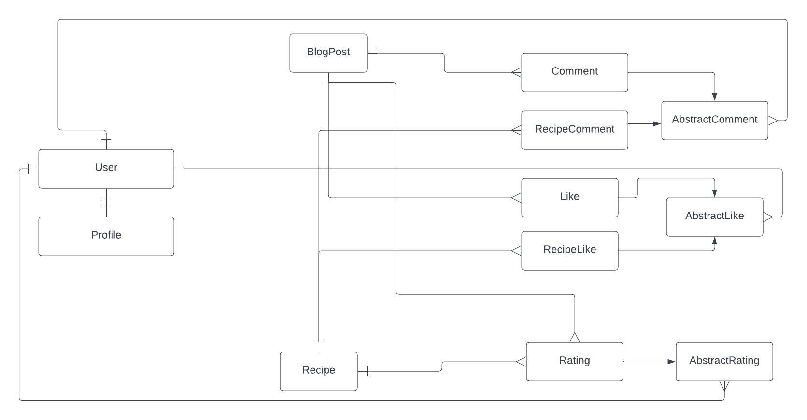
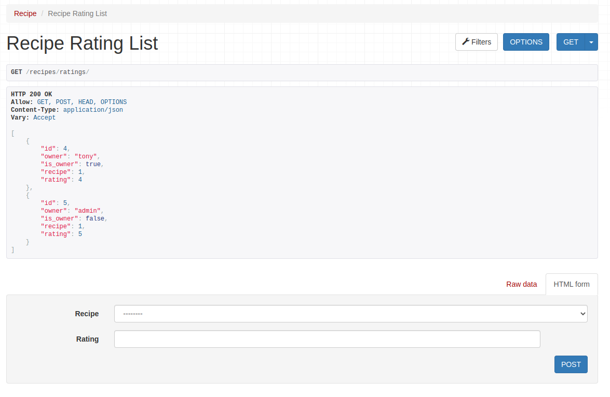
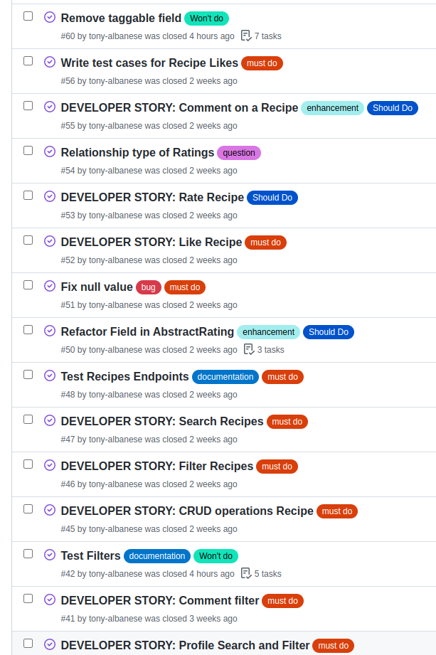
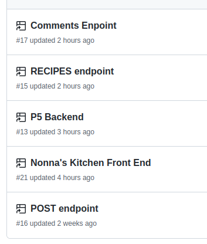
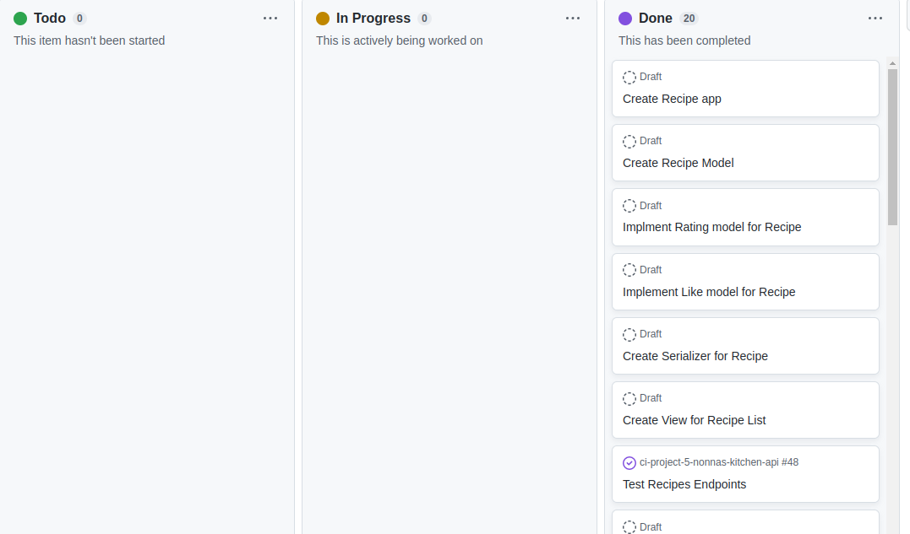
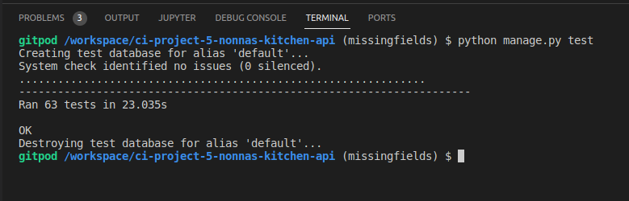
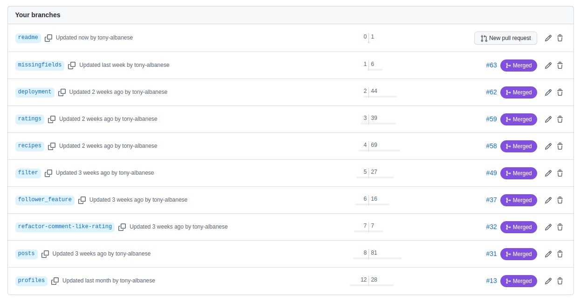

- [Nonna's Kitchen Backend](#nonna-s-kitchen-backend)
  * [Developer User Stories](#developer-user-stories)
    + [Profiles](#profiles)
    + [Posts](#posts)
    + [Comments](#comments)
    + [Likes](#likes)
    + [Followers](#followers)
    + [Search and Filter](#search-and-filter)
    + [Recipes](#recipes)
- [Database Design](#database-design)
  * [Models](#models)
- [Features](#features)
  * [Profiles Endpoint](#profiles-endpoint)
  * [Posts endpoint](#posts-endpoint)
  * [Comment Endpoint](#comment-endpoint)
  * [Like endpoint](#like-endpoint)
  * [Follower endpoint](#follower-endpoint)
  * [Search and Filter](#search-and-filter-1)
  * [Recipe endpoint](#recipe-endpoint)
  * [Recipe Rating Endpoint](#recipe-rating-endpoint)
- [Agile Workflow](#agile-workflow)
- [Testing](#testing)
  * [Behavior Driven Development (BDD)](#behavior-driven-development--bdd-)
  * [Test Driven Development (TDD)](#test-driven-development--tdd-)
- [Version Control Strategy](#version-control-strategy)
- [Deployment](#deployment)
  * [Technology Used](#technology-used)
  * [Project Creation](#project-creation)
  * [Deployment to Heroku](#deployment-to-heroku)
- [Credits](#credits)

<small><i><a href='http://ecotrust-canada.github.io/markdown-toc/'>Table of contents generated with markdown-toc</a></i></small>


# Nonna's Kitchen Backend
Food has the power to invoke strong emotions - especially food that is connected with our ancestors, family, and culture. Nonna's Kitchen API (Nonna is Italian for grandmother) provides the backend for the creation, storage, retrieval, search, and filtering of content that centers around the food of our ancestors and culture. The two main content types are a BlogPost and a Recipe. A BlogPost allows a user to write a short paragraph describing the emotional connection they have with a dish and upload a picture if they choose. A Recipe is just that - a way for users to share the recipes of their culture with the community. 

This API provides the necessary resources to manage users, create, rate, and comment upon content as well as to search and filter content depending on what features a front-end developer wishes to implement.

## Links to Deployed Project
+ The project is deployed on Heroku and is available at the folowing link: [Deployed Nonna's Kitchen API](https://nonnas-kitchen-api.herokuapp.com/)
+ The link for the GitHub repo to corresponding front end for this project is here: [Nonna's Kitchen Front End](https://github.com/tony-albanese/nonnas-kitchen)

# Project Structure
The overall structure of the project was modelled from from the [drf-api](https://github.com/Code-Institute-Solutions/drf-api) walktrhough. This is to be expected since the walkthrough follows an insdustry standard way of implementing an API. In addition, the strucutre of the serializer, model, and url files are also adapted from the walkthrough since this is the "pythonic" way of implementing an API using the Django REST framework.

## Developer User Stories
### Profiles
+ As a developer using Nonna's Kitchen backend to build applications, I want to fetch a list of profiles so that I can display them to the user in my application.
+ As a developer using Nonna's Kitchen backend to build applications, I want to fetch the data from one profile so that I can display it to the user for them to edit.
+ As a developer using Nonna's Kitchen backend to build applications, I want and endpoint to modify profile data so that I can provide profile editing features to end users.
+ As a developer using Nonna's Kitchen backend to build applications, I want to fetch profile data with permissions so that I protect sensitive user data from exposure and compromise.

### Posts
+ As a developer using Nonna's Kitchen backend to build applications, I want an endpoint to get all posts so that I do not have to manually query the database to get the data.
+ As a developer using Nonna's Kitchen backend to build applications, I want to have an endpoint to save a Post object to the database so that users of my application can share their content.
+ As a developer using Nonna's Kitchen backend to build applications, I want to have an endpoint to delete a Post so that I do not have to manually update the database when a user deletes their post.
+ As a developer using Nonna's Kitchen backend to build applications, I want to and endpoint to update a Post so that I do not have to manually update the database when a user updates their post.
+ As a developer using Nonna's Kitchen backend to build applications, I want the backend to prevent users from modifying or deleting posts that they did not author so that I do not have to check for permissions manually.

### Comments
+ As a developer using Nonna's Kitchen backend to build applications, I want an endpoint for users to comment on a post so that I do not have to manually write to the database on the front end.
+ As a developer using Nonna's Kitchen backend to build applications, I want an endpoint for users to update a comment on a post so that I do not have to manually write to the database on the front end.
+ As a developer using Nonna's Kitchen backend to build applications, I want an endpoint to get all of the comments so that I do not have to query the database manually.
+ As a developer using Nonna's Kitchen backend to build applications, I want the backend to prevent the user from modifying or deleting comments that they are not the author of so that I do not have to implement these checks on the front end.

### Likes
+ As a developer using Nonna's Kitchen backend to build applications, I want to have an endpoint to add a like to a BlogPost so that I do not have to query the database manually.
+ As a developer using Nonna's Kitchen backend to build applications, I want to have an endpoint to delete a like so that I do not have to + query the database manually.
+ As a developer using Nonna's Kitchen backend to build applications, I want to the backend to prevent users from deleting a like they did not create so that I do not have to perform this check on the front end.

### Followers
+ As a developer using Nonna's Kitchen backend to build applications, I want an endpoint to allow a user to follow another user so that I do not have to manually query the database.
+ As a developer using Nonna's Kitchen backend to build applications, I want an endpoint to allow users to unfollow each other so that I do not have to query the database manually.
+ As a developer using Nonna's Kitchen backend to build applications, I want to get a list of followers with an endpoint so that I do not have to query the database manually.
+ As a developer using Nonna's Kitchen backend to build applications, I want to the backend to implement permissions about followers so that I do not have to manually implement security features on the front end.

### Search and Filter
+ As a developer using Nonna's Kitchen backend to build applications, I want to get all the comments that belong to a blogpost so that I can display them to the user without having to query the database.
+ As a developer using Nonna's Kitchen backend to build applications, I want to filter Profiles by follower so that I do not have to manually query the database.
+ As a developer using Nonna's Kitchen backend to build applications, I want to have search and filter functionality for a BlogPost so that I do not have to manually query the database.

### Recipes
+ As a developer using Nonna's Kitchen backend to build applications, I want and endpoint to perform CRUD operations on a RECIPE so that I do not have query the database manually.
+ As a developer using Nonna's Kitchen backend to build applications, I want an endpoint to **filter a recipe ** so that my users can see the data they want without me having to query the database manually.
+ As a developer using Nonna's Kitchen backend to build applications, I want an endpoint to **search recipes ** so that my users can see the data they want without me having to query the database manually.
+ As a developer using Nonna's Kitchen backend to build applications, I want an endpoint to like a recipe so that I can have my users mark content they like without having to query the database manually.
+ As a developer using Nonna's Kitchen backend to build applications, I want an endpoint to comment on a recipe so that I can have my users share their opinions on content.
+ As a developer using Nonna's Kitchen backend to build applications, I want to have an endpoint for users to rate a Recipe so that I can give them a way to evaluate content without having to query the database myself.

# Database Design
## Models
The **User** model is an extension of the **AbstractUser** model from Django authorization app. The reason for doing so is to make it easier to customize the User model should the need arise. In Django, it is exceedingly difficult, if not impossible, to modify the User object in the middle of a project without resetting the database. Using a custom model from the start, even if unmodified, should make future changes much less painful. 

settings.py was modified with the following setting so that django authorization uses this custom model.
```
AUTH_USER_MODEL = 'kitchen_user.User'
```

The **AbstractLike** model encapsulates the information common to all likes. This model is marked as abstract so that a table will not be created for it. The owner field is one-to-many because a Like can have only one author but a User can have many Likes.  Other types of Like models can inherit from this model and add the fields needed. 

|AbstractLike ||
|-----|----|
|type|field name|
|ForeignKey(User)|owner|
|DateTimeField|created_on|

The **AbstractComment** model encapsulates the information common to all comments. This model is marked as abstract so that a table will not be created for it. The author field is a one-to-many relationship with a User since each Comment can only have one author.
|AbstractComment ||
|-----|----|
|type|field name|
|ForeignKey(User)|author|
|DateTimeField|created_on|
|TextField|body|

The **Profile** model encapsulates the extra data to enhance the standard information in the User model. The Profile contains additional fields for a biography, an avatar, and a cooking specialty.
|Profile ||
|-----|----|
|type|field name|
|ForeignKey(User) |owner|
|DateTimeField|created_on|
|CharField|first_name|
|CharField|last_name|
|TextField|bio|
|CharField|specialty|
|ImageField|avatar|

The **BlogPost** model encapsulates the information a user wants to share on the site. The idea behind a **BlogPost** object is that is supposed to be relatively short (1 to 2 paragraphs) and is supposed to represent a memory or anecdote connected to food from their ancestors. In addition to content, the user can (and should) attach a photo to the post. In addition, they must categorize the post as a history, anecdote, or tip. 

|BlogPost ||
|-----|----|
|type|field name|
|ImageField|cover_image|
|User|author|
|DateTimeField|created_on|
|CharField|title|
|TextField|content|
|UrlField|link|
|CharField|category|

The **Comment** model encapsulates the information required for a User to leave a comment on a BlogPost. It extends the AbstractComment model.  There is a also a one-to-money relationship with the BlogPost because each Comment can only belong to one BlogPost but a BlogPost can have many Comments.
|Comment ||
|-----|----|
|type|field name|
|ForeignKey(BlogPost)|blog_post|


The **Like** model encapsulates the information required for a User to like a BlogPost. It inherits from AbstractBlogPost  The blog_post field is also one-to-many since each Like can only belong to one BlogPost but each BlogPost can have many likes.
|Like ||
|-----|----|
|type|field name|
|ForeignKey(BlogPost)|blog_post|


The **Follower** model encapsulates the information required for a User to follow another User. The following field is the User that is following a User. The follower field is the User that is followed by the user in the following field.
|Like ||
|-----|----|
|type|field name|
|ForeignKey(User)|following|
|ForeignKey(User)|follower|
|DateTimeField|followed_on|


The **Recipe** model encapsulates the information required for a Recipe object in the database.
|Recipe ||
|-----|----|
|type|field name|
|ForeignKey(User)|author|
|CharField|title|
|TextField|description|
|CharField(ChoiceField)|dish_type|
|CharField(ChoiceField)|difficulty|
|IntegerField|time|
|CharField(ChoiceField)|time_unit|
|IntegerField|servings|
|JSONField|ingredients|
|JSONField|procedure|
|TaggableManager|tags|
|ImageField|recipe_image|
|DataTimeField|posted_on|


The **RecipeLike** model encapsulates the information required for a User to like a Recipe. The model inherits from the AbstractLike model. The recipe field will link this model to a Recipe model.

|RecipeLike ||
|-----|----|
|type|field name|
|ForeignKey(Recipe)|recipe|

The **RecipeComment** model encapsulates the information required for a User to leave a comment on a Recipe. It extends the AbstractComment model.  There is a also a one-to-money relationship with the Recipe because each RecipeComment can only belong to one Recipe but a Recipe can have many RecipeComments.
|Comment ||
|-----|----|
|type|field name|
|ForeignKey(Recipe)|recipe|

The **AbstractRating** model encapsulates the information common to all ratings. The user field is OneToMany because a User can have multiple ratings but each Rating can belong to only one User.

|AbstractRating ||
|-----|----|
|type|field name|
|ForeignKey(User)|owner|
|IntegerField|rating|

The **RecipeRating** model encapsulates the information required for a User to rate a Recipe. It extends the AbstractRating model. The recipe field is OneToMany because a Recipe can have many RecipeRatings but each RecipeRating can belong to only one Recipe. There is a unique_together field between recipe and owner to prevent a user from leaving multiple ratings on a Recipe.

|RecipeRating ||
|-----|----|
|type|field name|
|ForeignKey(Recipe)|recipe|

The relationships between all of these models is summarized in the followed entity relationship diagram:


# Features
## Profiles Endpoint
```
GET profiles/
```
This endpoint will return all of the profiles.

> As a developer using Nonna's Kitchen backend to build applications, I want to fetch a list of profiles so that I can display them to the user in my application.

```
GET profiles/<int:id>
PUT profiles/<int:id>
```
This endpoint will retrieve the details for a particular Profile. The id (which serves as the primary key), is used to determine which Profile to fetch. If the current user is the owner of the Profile, they are allowed to edit it and save the changes. Otherwise, they can only view it. In the following screenshots, one Profile belongs to the user and the other not. They can edit the one that belongs to them.
  

> + As a developer using Nonna's Kitchen backend to build applications, I want to fetch the data from one profile so that I can display it to the user for them to edit.  
> + As a developer using Nonna's Kitchen backend to build applications, I want and endpoint to modify profile data so that I can provide profile editing features to end users.  
> + As a developer using Nonna's Kitchen backend to build applications, I want to fetch profile data with permissions so that I protect sensitive user data from exposure and compromise.  

## Posts endpoint
```
GET posts/
POST posts/
```
This endpoint fetches all of the posts from the database. If the user is authenticated, they are allowed to add a post.

> + As a developer using Nonna's Kitchen backend to build applications, I want an endpoint to get all posts so that I do not have to manually query the database to get the data.  
> + As a developer using Nonna's Kitchen backend to build applications, I want to have an endpoint to save a Post object to the database so that users of my application can share their content.

```
GET posts/<int:id>
PUT posts/<int:id>
DELETE posts/<int:id>
```
These endpoints are to view the details for an individual post. If the user is authenticated, they can modify or delete the post ONLY if they are the author of the post.

> + As a developer using Nonna's Kitchen backend to build applications, I want to have an endpoint to delete a Post so that I do not have to manually update the database when a user deletes their post.
> + As a developer using Nonna's Kitchen backend to build applications, I want to and endpoint to update a Post so that I do not have to manually update the database when a user updates their post.
> + As a developer using Nonna's Kitchen backend to build applications, I want the backend to prevent users from modifying or deleting posts that they did not author so that I do not have to check for permissions manually.

## Comment Endpoint
```
GET comments/
POST comments/
```
These endpoints return all of the comments in the database (GET) and allow a user to add a comment to a particular BlogPost if they are logged in.


> + As a developer using Nonna's Kitchen backend to build applications, I want an endpoint for users to comment on a post so that I do not have to manually write to the database on the front end.
> + As a developer using Nonna's Kitchen backend to build applications, I want an endpoint to get all of the comments so that I do not have to query the database manually.
> + As a developer using Nonna's Kitchen backend to build applications, I want the backend to prevent the user from modifying or deleting comments that they are not the author of so that I do not have to implement these checks on the front end.

```
GET comments/<int:id>
PUT comments/<int:id>
DELETE comments/<int:id>
```
These endpoints allow a user to modify a comment if they are logged in AND are the author of the comment. 

> + As a developer using Nonna's Kitchen backend to build applications, I want an endpoint for users to update a comment on a post so that I do not have to manually write to the database on the front end.
> + As a developer using Nonna's Kitchen backend to build applications, I want the backend to prevent the user from modifying or deleting comments that they are not the author of so that I do not have to implement these checks on the front end.

## Like endpoint
```
GET likes/
POST likes/
GET likes/<int:id>
DELETE likes/<int:id>
```

This endpoint allows users to retrieve a list of likes, create a like, and delete a like. (There is no need to update a like.) In addition, permissions are enforced so that only authenticated users can like a BlogPost and they can only delete a like if they are the owner of the like.
  

> + As a developer using Nonna's Kitchen backend to build applications, I want to have an endpoint to add a like to a BlogPost so that I do not have to query the database manually.
> + As a developer using Nonna's Kitchen backend to build applications, I want to have an endpoint to delete a like so that I do not have to query the database manually.
> + As a developer using Nonna's Kitchen backend to build applications, I want to the backend to prevent users from deleting a like they did not create so that I do not have to perform this check on the front end.


## Follower endpoint
```
POST followers/
GET followers/
GET followers/<int:id>
DELETE followers/<int:id>
```
This endpoint allows users to follow and unfollow each other. In addition, one can retrieve the list of all Followers for filtering and analysis.
 

> + As a developer using Nonna's Kitchen backend to build applications, I want an endpoint to allow a user to follow another user so that I do not have to manually query the database.
> + As a developer using Nonna's Kitchen backend to build applications, I want an endpoint to allow users to unfollow each other so that I do not have to query the database manually.
> + As a developer using Nonna's Kitchen backend to build applications, I want to get a list of followers with an endpoint so that I do not have to query the database manually.
> + As a developer using Nonna's Kitchen backend to build applications, I want to the backend to implement permissions about followers so that I do not have to manually implement security features on the front end.

## Search and Filter
Searching and filtering has been added for the BlogPost, Comment, and Profile models. Specifically, one can search a BlogPost by title or author user name. One can also filter the BlogPosts based on category, author, whether its liked, by owner and by follower. The Comments have a filter field so that only the comments belonging to a BlogPost can be displayed. And Profiles can be filtered by follower - a user can see who follows them and the profiles of user they follow.
+ BlogPost Filter Form

+ BlogPost Filter Result

+ Filtered Comments

+ Follower Filter


> + As a developer using Nonna's Kitchen backend to build applications, I want to get all the comments that belong to a blogpost so that I can display them to the user without having to query the database.
> + As a developer using Nonna's Kitchen backend to build applications, I want to filter Profiles by follower so that I do not have to manually query the database.
> + As a developer using Nonna's Kitchen backend to build applications, I want to have search and filter functionality for a BlogPost so that I do not have to manually query the database.


## Recipe endpoint
```
POST recipes/
GET recipes/
GET recipes/<int:id>/
PUT recipes/<int:id>/
DELETE recipes/<int:id>/
```
This endpoint allows a User to enter a Recipe if they're logged in or to get a list of all the recipes if they are not. A User can update or delete a recipe if they are the owner. A user can also like a recipe if they are logged in and see how many likes a recipe can have. Recipes can be searched by title and type and filtered by type, author, difficulty, and author profile.  A user can remove their own like from a Recipe. This functionality is tested in the [TDD test cases](test_tdd_cases.md) file.

+ Recipes List

+ Add a recipe if User logged in

+ Search and filter Recipes

+ See list of Likes for Recipe

+ Like a Recipe if logged in.


> + As a developer using Nonna's Kitchen backend to build applications, I want and endpoint to perform CRUD operations on a RECIPE so that I do not have query the database manually.
> + As a developer using Nonna's Kitchen backend to build applications, I want an endpoint to **filter a recipe ** so that my users can see the data they want without me having to query the database manually.
> + As a developer using Nonna's Kitchen backend to build applications, I want an endpoint to **search recipes ** so that my users can see the data they want without me having to query the database manually.
> + As a developer using Nonna's Kitchen backend to build applications, I want and endpoint to like a recipe so that I can have my users mark content they like without having to query the database manually.

+ Commenting on a recipe
```
POST recipes/comments/
GET recipes/comments/
GET recipes/comments/<int:id>/
PUT recipes/comments<int:id>/
DELETE recipes/comments<int:id>/
```
This endpoint allows users to leave a comment on a recipe if they are logged in. A user can get a list of all the recipe comments. Permissions are implemented so that a user can only update and delete their own comments.
 
> + As a developer using Nonna's Kitchen backend to build applications, I want an endpoint to comment on a recipe so that I can have my users share their opinions on content.

## Recipe Rating Endpoint
```
POST recipes/ratings/
GET recipes/ratings/
GET recipes/ratings/<int:id>/
PUT recipes/ratings<int:id>/
DELETE recipes/ratings<int:id>/
```
This endpoint allows a User to rate a Recipe. A valid rating must be an integer between 1 and 5. A User can get a list of ratings and create a new rating if they are logged in. They can update a rating if they are the owner. A user is prevented from updating or deleting a Rating they do not own. They cannot leave multiple ratings for a Recipe, but they can update the value of a current rating.
  
> + As a developer using Nonna's Kitchen backend to build applications, I want to have an endpoint for users to rate a Recipe so that I can give them a way to evaluate content without having to query the database myself.  
A field for the average rating has also been added to the RecipeList view to display the average rating associated for a recipe.


# Agile Workflow
An Agile approach was used to manage the completion of this project. Specifically, this meant breaking the project down into smaller tasks with a focus on minimum functionality first. Only when a minimally viable product is ready will extra features be added. In addition, GitHub projects and Issues were used a tool to keep track of the tasks.

What does minimally functioning mean in this context? As with any project, there are real constraints (time, energy, know-how) that force a developer to prioritize the work. Based on my abilities and constraints, I have prioritized the project requirements in the following way. Each entry is a sprint as is designed to encompass one to two full day's work.

* User and Profile models and views
* BlogPost with models, views, and serializers, full CRUD
* Comment with models, views, and serializers, full CRUD
* Like with models, views, and serializers, full CRUD
* Unit testing
* Recipe with models, views, and serializers, full CRUD
* Like for a Recipe
* Comment for a Recipe
* Rating with models, views, and serializers, full CRUD
* Unit test Recipe and Rating

Each larger scale task was given a GitHub issue. This included the user stories, and anything else that would require attention. Issues were assigned labels to help prioritize them in the work flow. As can be seen, some issues are marked as "Must Do" while others are marked as "Should Do". Some issues are enhancements, others are questions requiring research. Often, if I ran into a problem that was not critical to fix or if I thought of a feature that I would like to add, I created an issue and assigned it a label to help me keep track of how important it is. The key is that essential features and critical issues were fixed first.



Issues often are related to each other - this includes user stories and additional features. For example, user stories around CRUD operations belong together as well as issues involved with search and styling. To help keep issues organized, those that are related to each other were organized into projects.



In the "Recipes Endpoint" project, one can see all the issues that were completed during the course of the project.

# Testing
## Behavior Driven Development (BDD)
The testing done here is BDD - each test is described as a story in which a description of the software requirements, the user actions, and the expected outcome are given along with a result of PASS or FAIL. To reduce the length of the readme, here is a link to the [testing tables](test_cases.md) describing the various test cases.

## Test Driven Development (TDD)
A form of TDD was performed in this project. Strictly speaking, the tests should be written first and the code after. Here, the code was written first and then test cases were written using APITestCase class from the Django REST framework. Here is a link to the [TDD test cases](test_tdd_cases.md).

The results of running the tests are shown in the following screenshot:  


# Unfixed Bugs
At the time of this writing, I am not aware of any serious bugs in the code. However, there is one issue that should be addressed at some point. That issue has to be with the two JSON field types (procedure and ingredients) in the Recipe model. Currently, the only validation that is performed is if the field is if the data is in JSON format. That, however, does no prevent any user of this API from writing a front-end to post data to these fields in any JSON format they wish. It is very easy to encapsulate any kind of data at all in a JSON format and at this point, the API would accept that data. That would result in problems displaying recipe steps and ingredients on the front-end if this data were inconsistently formatted.

Since there is only one developer and consumer of this API, this is ok for now. But should this API be released to the wider public for greater consumption, then this potential data problem should be addressed. Specifically, incoming POST data could be validated against a JSON schema before it is allowed to be written to the database. That would force front end developers to submit data in a consistent and standard format. 

Generating and using a JSON schema to validate data is beyond the scope of the project at this time but should definitely be incorporated into a future release.

# Version Control Strategy
Git was employed in this project and the project code hosted on GitHub. I used branches in order to keep the main branch as "pure" as possible. The strategy was to have each branch dedicated to one feature or fix. Once I was satisfied at a particular stage of a branch, I would navigate to GitHub, click on my repository, select the branch, and create a pull request. GitHub would then check if there are no conflicts and indicate if the branch could be merged into main. (One can choose which branch to merge into.) Once the pull request is created, I navigated down, wrote a comment, and clicked on the green Merge button and the commits would be merged into the main branch. I tried to keep commits as atomic as possible - focusing only on one element or feature at a time. This was not always the case, but most of the commits are relatively small changes. In addition, I tried not to mix features in a branch. Small tweaks to other features were allowed, but the majority of the work on each branch was dedicated to that one feature. This is in line with the agile method of tackling a project - the team (in this case me) should only work on one feature at a time. 



# Deployment
## Technology Used
+ [Cloudinary](https://cloudinary.com/) - Media cloud storage service to serve static files
+ [ElephantSQL](https://www.elephantsql.com/) - An online service running a PostgreSQL server as a service.
+ [Pillow](https://pillow.readthedocs.io/en/stable/) A Python imaging library to help process images.
+ [django-taggit](https://django-taggit.readthedocs.io/en/latest/)A django app for storing and searching tags

## Project Creation
+ Cloned Code Institute Repository and gave the new repository the name [ci-project-5-nonnas-kitchen-backend](https://github.com/tony-albanese/ci-project-5-nonnas-kitchen-backend)
+ Initialized GitPod Workspace by clicking on the GitPod button on the repository
+ Installed support libraries and Django according to the walkthrough on Code Institute the steps of which are outlined as follows:

    + Install django
    + Create project
    + Install Cloudinary Storage and Pillow
    ```
    $ pip install ‘django<4’
    $ django-admin startproject nonnas_kitchen .
    $ pip install django-cloudinary-storage
    $ pip install Pillow
    ```
    
    + Add these apps to settings.py
    ```
    INSTALLED_APPS = [
    (...)
    'cloudinary_storage',
    'django.contrib.staticfiles',
    'cloudinary',
    ]
    ```

    + Create env.py, add import os, and add variable for CLOUDINARY_STORAGE
    ```
    import os
    os.environ['CLOUDINARY_URL'] = 'url copied from cloudinary'
    ```
    + Update settings.py
    ```
    if os.path.exists('env.py'):
    import env

    CLOUDINARY_STORAGE = {
    'CLOUDINARY_URL': os.environ.get('CLOUDINARY_URL')
    }
    ```
    + Created profiles app and added it to settings.py
    ```
    $ python manage.py startapp profiles

    INSTALLED_APPS = [
        (...),
        'profiles',
    ]
    ```
    + Install Django REST Framework and update settings.py
    ```
    $ pip install djangorestframework

    INSTALLED_APPS = [
        'cloudinary',
        'rest_framework'
        'profiles'
    ]
    ```
## Deployment to Heroku
After development and testing, the backend was ready to deploy to Heroku. The procedure followed is that from Code Institute's walkthrough project DRF. The final deployment involved two broad steps: preparation and deployment to Heroku.

For improved readability, the steps followed are broken down into the following separate documents:
+ [Preparation for Final Deployment](deployment_prep.md)
+ [Deployment to Heroku](deployment_heroku.md)

# Credits
+ Default avatar: <a href="https://www.flaticon.com/free-icons/user" title="user icons">User icons created by logisstudio - Flaticon</a>
+ Default BlogPost image: <a href="https://www.freepik.com/free-vector/plate-cuttlery-graphic-illustration_2685788.htm#query=meal&position=1&from_view=search&track=sph">Image by rawpixel.com</a> on Freepik

+ The code for implementing a ratings bar came from this Medium blog post: [Django: Implementing Star Rating](https://medium.com/geekculture/django-implementing-star-rating-e1deff03bb1c)

+ The fix for the dj-rest-auth bug was taken from the [Code Institute's Repo](https://github.com/Code-Institute-Solutions/drf-api/blob/master/drf_api/views.py#L16) directly.

+ The code for the Profiles app was adapted from Code Institute's walkthrough project [drf-api](https://github.com/Code-Institute-Solutions/drf-api).
